# insightflow-documents-service

Microservicio encargado de la gestión de documentos dentro de la plataforma **InsightFlow**. Este módulo permite la creación, edición, organización y visualización de documentos asociados a espacios de trabajo, funcionando como el núcleo de contenido de la aplicación.

## Arquitectura y Patrón de Diseño

### Arquitectura del repositorio: Microservicios

El Documents Service implementa una arquitectura por capas (Layered Architecture), separando la lógica de negocio, el acceso a datos y la exposición de la API. Actualmente, utiliza una persistencia en memoria (simulada).

```mermaid
flowchart TD
    A[Client / Frontend]
    
    subgraph Documents_Service
        B1[Controller
DocumentController] --> B2[Service
DocumentService/Mapper]
        B2 --> B3[Repository
DocumentRepository/Models]
    end
    
    A -- REST API (JSON) --> B1
    B3 -.-> C["In-Memory Storage
(Simulación de DB)"]
```


### Patrones de diseño implementados:
1. **Repository Pattern:** Abstracción del acceso a datos (actualmente en memoria a través de DocumentRepository) para desacoplar la lógica de negocio de la persistencia.
2. **Data Transfer Object (DTO):** Uso de objetos de transferencia (Ej: CreateDocumentDto, UpdateDocumentDto) para asegurar que solo los datos necesarios viajen entre el cliente y el servidor.
3. **Service Layer**: La lógica de negocio reside en DocumentService, manteniendo el controlador limpio y enfocado solo en recibir peticiones y devolver respuestas HTTP.
4. **Soft Delete:** Implementación de borrado lógico para permitir la recuperación de documentos y mantener integridad referencial histórica.

## Tecnologías utilizadas
- **Framework:** ASP.NET Core 9.0
- **Protocolo API:** REST (HTTP/JSON).
- **Base de Datos:** Almacenamiento en memoria (In-Memory List).
- **Control de versiones:** Git con Conventional Commits

## Modelo de Datos
### Entidad Document
```
{
  "id": "Guid (UUID)",         // Identificador único del documento
  "title": "string",           // Título del documento
  "icon": "string",            // Emoji o ícono representativo (Default: 📄)
  "workspace_id": "Guid",      // ID del espacio de trabajo al que pertenece
  "content": "object",         // Contenido del documento (JSON/Bloques)
  "soft_deleted": "boolean"    // Bandera de estado para borrado lógico
}
```

## Endpoints del Servicio (REST API)

El servicio expone una API RESTful

| Método | Endpoint | Request | Descripción|
|--------|----------|-------------|-----------|
| `GET` | `/documents` | `N/A` | Consulta la lista completa de documentos activos. |
| `GET` | `/documents/{id}` | `N/A` | Obtiene el detalle de un documento específico por su ID.|
| `POST` | `/documents` | `CreateDocumentDto` | Crea un nuevo documento asociado a un Workspace. |
| `PATCH` | `/documents/{id}` | `UpdateDocumentDto` | Actualiza parcialmente (título, icono, contenido) un documento. |
| `DELETE` | `/documents/{id}` | `N/A` | Realiza un borrado lógico (soft delete) del documento. |

## Instalación y Configuración

- **.NET 9 SDK:** [Download](https://dotnet.microsoft.com/download/dotnet/9.0)
- **Visual Studio Code** [Download](https://code.visualstudio.com/) o IDE de preferencia.

1. **Clonar el repositorio**
    ```bash
    git clone <URL_DEL_REPOSITORIO>
    cd <Directorio donde fue clonado>
    ```
2. **Instalar Dependencias**
    ```bash
    dotnet restore
    ```

3. **Ejecutar el Proyecto**
    ```bash
    dotnet run
    ```
## Estructura de carpetas
```
/src
   ├── Controllers/      # Controladores de la API (Endpoints)
   ├── Dtos/             # Objetos de transferencia de datos (Request/Response)
   ├── Helpers/          # Mappers y utilidades
   ├── Models/           # Entidades del dominio
   ├── Repository/       # Capa de acceso a datos (Persistencia)
   └── Services/         # Lógica de negocio
```

### Ignacio Carvajal, 21.411.819-K
